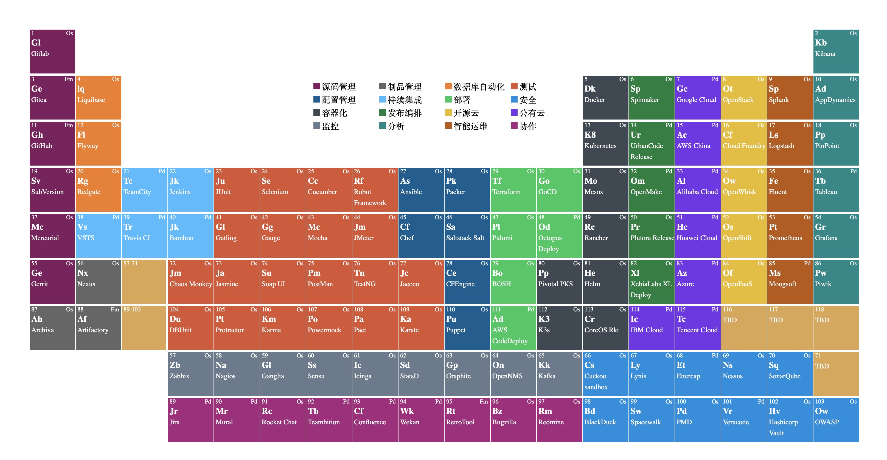

# DevOps Periodic

> A DevOps Tools Periodic Table for DevOps Learning and Design. Design with Web Component can use it any page.

## Inspired by

Periodic

 - [https://stackblitz.com/edit/ng-periodic-table](https://stackblitz.com/edit/ng-periodic-table)
 - [https://www.nexthink.com/periodic-table/](https://www.nexthink.com/periodic-table/)

others see in the Code.

License
---

@ 2020 A [Phodal Huang](https://www.phodal.com)'s [Idea](http://github.com/phodal/ideas).  This code is distributed under the MPL license. See `LICENSE` in this directory.
